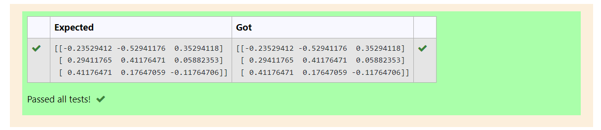

# INVERSE-OF-A-MATRIX
## Aim:
To write a python program to find the inverse of a matrix
## Equipment’s required:
1. 	Hardware – PCs
2. 	Anaconda – Python 3.7 Installation / Moodle-Code Runner
## Algorithm:
### Step1 : 

Get the matrix from the user
### Step 2: 
Using the np.linalg.inv(), we get the result(inverse matrix) of the given matrix.
### Step 3: 
Print the result(inverse of given matrix
### Step 4: 
End of the program.
## Program:
~~~
import numpy as np
A=np.array([[1,0,3],[-1,2,-2],[2,3,-1]])
inverse=np.linalg.inv(A)
print(inverse)
~~~
## Output:

## Result:
Thus the inverse of given matrix is successfully solved using python program

